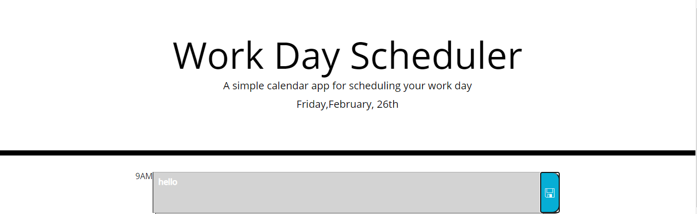

# day-planner

# Unit 5 Third-Party APIs: Day Planner Assignment

## Description
This project is a simple calendar application that allows users to save events for each hour of the day featuring HTML and CSS powered by JQuery code.

When prompted the day planner should meet the following criteria:

1. When a user comes to the page, the current date should appear below the title
2. The time slots will show whether they are in the past, present or future based on the colors grey, red and green
3. When a timeblock is clicked into, text should be able to be inputted 
4. When a user clicks the floppy disk to save, the data is stored in local storage and stays on the page 

## Screenshots

The following images shows the web application's appearance and functionality:

## Deployed Project Location: 
* Page published at: https://almurawski15.github.io/day-planner/

## Creator Comments

Had a speedy start to this assignment and felt I understood it easily! But I spent a lot of time bug fixing for such simple element errors but it was good practice all in all. 